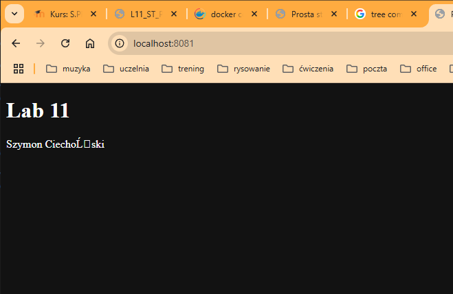

C:\Users\timor\OneDrive\Pulpit\lab11>docker network create --driver=bridge --subnet=10.0.0.0/24 lab11net
c2ed5c282e73d32d1d8ba4197f25955c60d2f55ee4882129c5c001e82c8df8ea

docker run -d --rm --name web1 --network=lab11net --ip=10.0.0.2 -p 8081:80 -v C:\Users\timor\OneDrive\Pulpit\lab11\html:/usr/share/nginx/html:ro -v C:\Users\timor\OneDrive\Pulpit\lab11\logs\web1:/var/log/nginx nginx:latest
b4c57a969d023e0b098d5cf161e7e8d6e04c9b219158616c2d0bcbd95b939139

docker run -d --rm --name web2 --network=lab11net --ip=10.0.0.3 -p 8082:80 -v C:\Users\timor\OneDrive\Pulpit\lab11\html:/usr/share/nginx/html:ro -v C:\Users\timor\OneDrive\Pulpit\lab11\logs\web2:/var/log/nginx nginx:latest
6bbba6e3ebe9658baa25726a6d219f1eb124e178effdf6611c3045ca6562c901

docker run -d --rm --name web3 --network=lab11net --ip=10.0.0.4 -p 8083:80 -v C:\Users\timor\OneDrive\Pulpit\lab11\html:/usr/share/nginx/html:ro -v C:\Users\timor\OneDrive\Pulpit\lab11\logs\web3:/var/log/nginx nginx:latest
10a1ae19239d8285f2e1b0864f63a985721a36821fe366b0a48e7ce7ef9941b5

Komenda nie działała na windowsie bez użycia pełnej ścieżki pliku

C:\Users\timor\OneDrive\Pulpit\lab11\logs>tree /F

C:.
├───web1
│       access.log
│       error.log
│
├───web2
│       access.log
│       error.log
│
└───web3
        access.log
        error.log

C:\Users\timor\OneDrive\Pulpit\lab11\logs>curl http://localhost:8081

C:\Users\timor\OneDrive\Pulpit\lab11\logs>curl http://localhost:8082

C:\Users\timor\OneDrive\Pulpit\lab11\logs>curl http://localhost:8083
